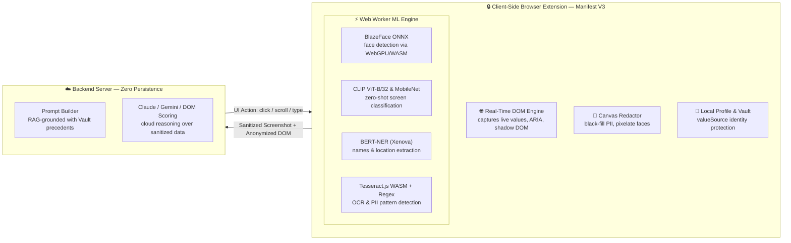

# 🛡️ Betaal (बेताल) — Client-Side Privacy-Preserving Browser AI Agent

> **"Sees Everything. Reveals Only What Matters."**  
> *Built for Smart India Hackathon (SIH) — Problem Statement SIH26171*


---

## 📋 1. Problem Statement & Project Overview

* **Hackathon**: Smart India Hackathon (SIH) 2026
* **Problem Statement ID**: **SIH26171**
* **Title**: On-device Visual Perception for Light-weight Browser Agents

### 🎯 Problem Statement
Most AI agent pipelines run server-side, requiring users to send full screenshots or DOM data to third-party cloud models. This is unacceptable for sensitive environments (government portals, banking, Aadhaar/PAN data) under India's **DPDP Act 2023**. SIH26171 challenges teams to build a **fully on-device browser agent** that processes visual perception locally, redacts PII before any data leaves the machine, and sends only anonymized UI metadata to a cloud VLM for action generation.

### 🏠 Project Overview
Betaal is a cross-browser extension (Chrome, Firefox & Edge, Manifest V3) that enables cloud Vision-Language Models to reason over and execute complex web tasks—filling forms, clicking through multi-step wizards, completing filings—without ever exposing raw PII or biometrics to a cloud server.

### 🌐 Live Production Deployments & Demos
* **Production Express Server Gateway**: [`https://betaal-backend-p8vk.onrender.com`](https://betaal-backend-p8vk.onrender.com)
* **Deployed Demo Portal (Single-Page Form + Video)**: [`https://annujjguptaa-cpu.github.io/Betaal/demo-page/`](https://annujjguptaa-cpu.github.io/Betaal/demo-page/)
* **Deployed Demo Wizard (Passport Application)**: [`https://annujjguptaa-cpu.github.io/Betaal/demo-page/passport-application.html`](https://annujjguptaa-cpu.github.io/Betaal/demo-page/passport-application.html)

---

## 🇮🇳 2. DPDP Act 2023 & Data Sovereignty

Betaal's privacy-preserving architecture—where no raw personal data or biometric pixels are transmitted over network requests—aligns with data minimization principles relevant under India's **Digital Personal Data Protection (DPDP) Act 2023**:
* **On-Device Data Sanitization**: All visual perception (OCR, BERT-NER, BlazeFace ONNX face detection) runs entirely in the user's browser before any payload crosses the network.
* **Zero PII Exposure**: Real identity values (Aadhaar, PAN, Phone, Address) are resolved locally on the device via the `valueSource` protocol—the cloud VLM only receives field keys, never actual personal data.
* **Zero Persistence Server**: The Express backend operates with transient memory processing—no screenshots, PII text, or telemetry logs are ever written to disk or external databases.

---

## 📸 3. Live Interface Showcase

| 🖥️ **Live View & Progress Feed** | 🔒 **Local Profile & Value Sourcing** |
| :---: | :---: |
|  |  |

---

## 🏗️ 4. System Architecture & Key Capabilities

### 🔑 Key Capabilities at a Glance

| Capability | What it means |
| :--- | :--- |
| **Zero-Trust Redaction Pipeline** | ViT screen classification, BERT-NER, OCR + regex PII detection, BlazeFace ONNX face detection, and canvas redaction all run on-device. |
| **Autonomous Agent Loop** | Capture $\rightarrow$ detect $\rightarrow$ redact $\rightarrow$ reason $\rightarrow$ act $\rightarrow$ repeat, owned by the background service worker. |
| **Human-in-the-Loop Intervention** | Automatically pauses on final actions, low confidence ($<0.6$), file uploads, or repeated failures with OS notifications and badge counts. |
| **Policy Book Engine** | User-editable runtime redaction rules with domain-specific overrides. |
| **Local Profile (`valueSource`)** | Identity values resolved strictly on-device; cloud VLM only receives key aliases. |
| **Set-of-Marks (SoM) & Agent Cursor** | Numbered bounding box overlays + green action highlight + animated Shadow DOM agent pointer. |
| **RAG-Grounded Reasoning** | Retrieves top-3 structural precedents from local Vault to eliminate selector hallucinations. |

### System Architecture Diagram



---

## 👥 5. Team Roster

| Member | GitHub Username | Role & Contributions |
| :--- | :--- | :--- |
| **Anuj Gupta** | [`@annujjguptaa-cpu`](https://github.com/annujjguptaa-cpu) | **Team Lead & Core Architect** (Browser Agent Loop, RAG Vault Engine, Multi-VLM Key Pooling & System Design) |
| **Anjali Singh** | [`@Anjali-byte04`](https://github.com/Anjali-byte04) | **Lead AI/ML Engineer** (On-Device Vision Models: BlazeFace ONNX, CLIP ViT-B/32, BERT-NER & Web Workers) |
| **Kumar Nishkarsh** | [`@Nishkrx`](https://github.com/Nishkrx) | **Lead Privacy & Security Engineer** (Canvas Redaction Pipeline, Local `valueSource` Store & Policy Book Engine) |
| **Drishti Pahuja** | [`@drishtipahuja80-debug`](https://github.com/drishtipahuja80-debug) | **Frontend & Extension UI Developer** (5-Tab Popup UI, Agent Cursor & Live Progress Telemetry Feed) |
| **Disha Yadav** | [`@dishayadav15160-cyber`](https://github.com/dishayadav15160-cyber) | **Backend & API Systems Engineer** (Express Gateway, DOM Extractor & Rate-Limiting Subsystems) |
| **Pragati** | [`@jainpragatii`](https://github.com/jainpragatii) | **QA & Benchmarking Specialist** (Autonomous CDP Profiling Scripts, Latency/Memory Budgets & Verification) |

> 📌 **Note on Repository Commit History**: All team members developed their respective modules locally and shared their code into the central project repository. Commits were integrated and pushed via Team Lead Anuj Gupta's GitHub account (`@annujjguptaa-cpu`), which is why individual team member handles may not reflect on the GitHub contributor graph despite their direct code contributions.

---

## 🎯 6. Judging Criteria Alignment & Benchmarks

| Metric | Weight | Our Approach | Key Features & Measured Real Data |
| :--- | :--- | :--- | :--- |
| **Accuracy of Visual Context** | **25%** | Real-time DOM Extraction + Tesseract OCR | Captures 100 interactive elements with live typed values, ARIA labels, roles, and shadow DOM. Visual grounding backed by CLIP ViT-B/32 zero-shot classification. |
| **PII Detection Recall/Precision** | **20%** | Multi-Layer Detection (Regex + BERT-NER) | Regex handles Aadhaar, PAN, phone, email, and generic 9+ digit IDs. `Xenova/bert-base-NER` token classification catches person names, locations, and orgs in free text. |
| **Precision of Redaction** | **20%** | Canvas 2D Policy-Aware Redaction | Bounding-box exact canvas redactor (blackfill PII text, block pixelate faces). Zero sensitive pixels touch the network. |
| **Client-Side Resource Utilization** | **20%** | Web Workers + Quantized Models + Memory Budget | Heavy ML runs off-main-thread via Web Workers (`detection-worker.js`). Total extension RAM measured at `423.2 MB` (Avg of 3 runs, within 500 MB hard cap). Fast mode MobileNet footprint is ~4MB. |
| **End-to-End Latency** | **15%** | Performance Modes + Local RAG Grounding | Switchable Fast / Balanced / Accurate modes. Measured demo page pipeline: `2640 ms` total per iteration (including 300ms pacing delay & cloud VLM round-trip). |

---

## ✅ 7. Must-Haves Checklist & Risk Mitigation

### Must-Haves Checklist
- [x] **Cross-Browser Compatibility**: Runs natively on Chrome, Edge, and Firefox (Manifest V3 + `browser-polyfill.js`).
- [x] **Client-Side Local Vision**: BlazeFace ONNX, CLIP ViT-B/32, BERT-NER, and Tesseract OCR run 100% on-device (WebGPU/WASM).
- [x] **Pre-Network PII Redaction**: Sensitive visual regions and face biometrics are masked on HTML5 canvas *before* POST requests fire.
- [x] **Sanitized Server Payload**: Server receives only redacted image base64, anonymized DOM structure, and `valueSource` key aliases.
- [x] **End-to-End Autonomous Task Execution**: Complete multi-page workflow demonstrated (Form Navigation $\rightarrow$ Data Input $\rightarrow$ Final Submission).
- [x] **Tamper-Evident Audit Trail**: Durable Vault logs every run outcome, detection counts, and policy snapshots locally in `chrome.storage.local`.

### Risk Mitigation Strategy
| Risk | Mitigation Strategy | Implementation |
| :--- | :--- | :--- |
| **Selector Fragility / Dynamic DOM Changes** | Pre-action validation + Self-Correction Retry | Re-validates selector presence in `content.js` immediately before execution. Re-prompts VLM up to 2 times with fresh DOM if missing (`background.js`). |
| **Bot Detection & Rate Limiting** | Human-like Pacing & Red Highlight Pointer | Adds deliberate pacing delay (300ms) + smooth animated Agent Cursor gliding to element coordinates (`agent-cursor.js`). |
| **Trust in Autonomous Decisions** | Mandatory Human-in-the-Loop Interventions | Automatically pauses execution on final/irreversible actions, low confidence (<0.6), file inputs, or repeated failures (`intervention-rules.js`). |
| **Latency vs. Accuracy Tradeoff** | Switchable Performance Modes | User can switch between `Fast` (MobileNet 4MB / 5ms), `Balanced` (Default ONNX / 45ms), and `Accurate` (1.5x upscaling) at runtime. |

---

## 🚀 8. Quick Start & Setup Guide

### 1. Installation
```bash
git clone https://github.com/annujjguptaa-cpu/Betaal.git
cd Betaal
npm install
```

### 2. Configure Environment Keys
Create a `.env` file in the project root with your API keys:
```env
PORT=3000
GEMINI_API_KEYS=key1,key2,key3
ANTHROPIC_API_KEYS=key1,key2
```

### 3. Run the Backend Server
```bash
npm start
```

### 4. Load Extension in Browser
1. Open Chrome/Edge $\rightarrow$ `chrome://extensions`
2. Enable **Developer mode**
3. Click **Load unpacked**, select the `Betaal` folder
4. Open extension popup, enter a goal, and click **Run Agent**

---

## 📚 9. Related Project Documents

- 🌐 **[Deployed Demo Sites & Server Gateway Guide](docs/deployed-demo-sites.md)** — Production Express server on Render (`betaal-backend-p8vk.onrender.com`) & live GitHub Pages demo sites.
- 📄 **[Memory Budget & Profiling Report](docs/memory-budget.md)** — 3x RAM profiling across background worker, content script, popup UI, and ONNX models (423.2 MB avg, within 500 MB hard cap).
- ⏱️ **[Pipeline Latency Budget Report](docs/latency-budget.md)** — Stage-by-stage latency analysis comparing demo page vs. real public portal execution.
- 🎬 **[Timed Presentation & Demo Script](docs/demo-script.md)** — Step-by-step 3-minute pitch script with live adversarial verification instructions.
- 🛡️ **[Kill-Switch & Offline Verification](docs/kill-switch-demo.md)** — Procedure to verify on-device vision processing with network disconnected.
- 🌐 **[Real-Site Generalization Testing](docs/generalization-testing.md)** — Evaluation notes across banking, e-commerce, and single-page apps (SPAs).
- 📊 **[RAG Retrieval Effectiveness Report](docs/rag-effectiveness.md)** — Before/after comparison proving structural signature RAG accuracy gains.
- 🦊 **[Firefox Build & Deployment Guide](docs/firefox-build.md)** — Manifest V3 Firefox compatibility, polyfill shims, and CSP settings.

---

## 🔗 10. Key References & License

* **Problem Statement**: Smart India Hackathon (SIH) 2026 — PS171 (*On-device Visual Perception for Light-weight Browser Agents*)
* **Transformers.js (v3)**: [HuggingFace Transformers.js](https://huggingface.co/blog/transformersjs-v3) — Client-side CLIP ViT and BERT-NER execution
* **ONNX Runtime Web**: [Microsoft ONNX Runtime Web](https://onnxruntime.ai/docs/execution-providers/WebGPU-ExecutionProvider.html) — WebGPU and WASM inference engine for BlazeFace
* **DPDP Act 2023**: [Digital Personal Data Protection Act 2023](https://www.meity.gov.in/writereaddata/files/Digital%20Personal%20Data%20Protection%20Act%202023.pdf) — Ministry of Electronics and Information Technology (MeitY)
* **Tesseract.js**: [Tesseract.js WASM Engine](https://tesseract.projectnaptha.com/) — On-device Optical Character Recognition
* **Google Gemini & Anthropic Claude**: Cloud Vision-Language Model APIs for sanitized context reasoning

---

## 📄 License

ISC License
