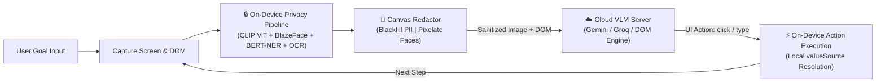
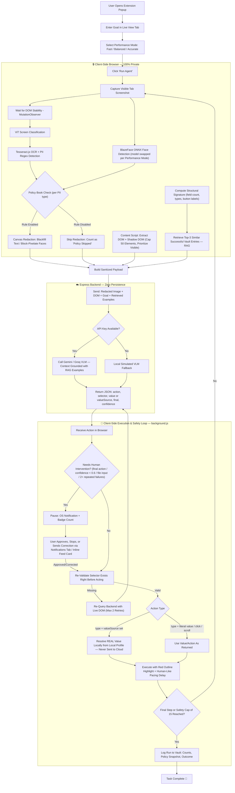
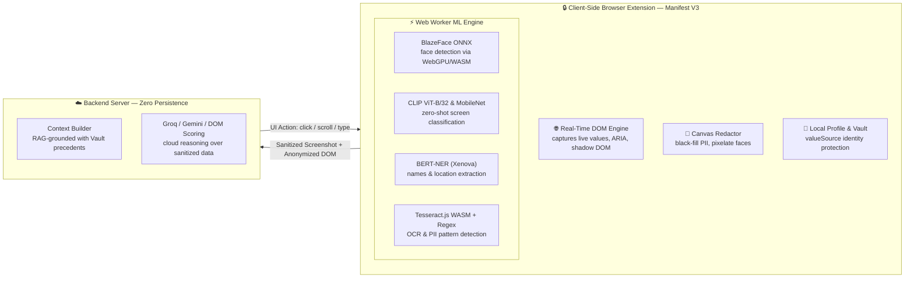
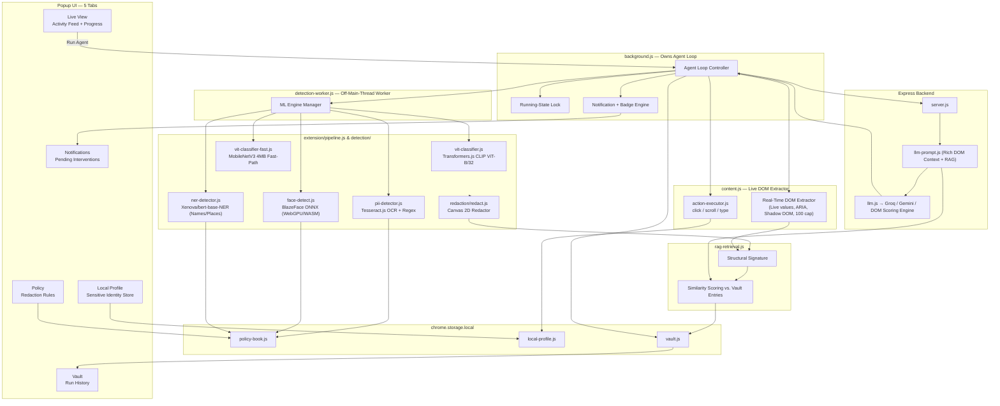
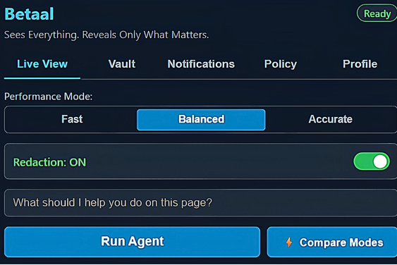
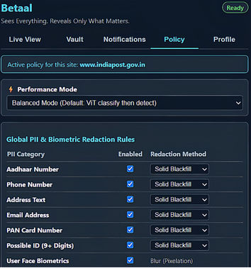
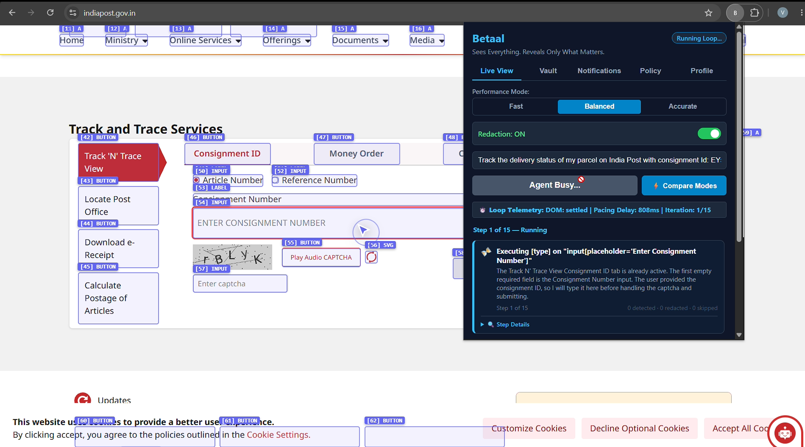
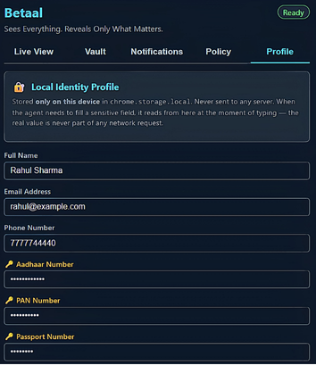

# 🛡️ Betaal (बेताल) — Client-Side Privacy-Preserving Browser AI Agent

> **"Sees Everything. Reveals Only What Matters."**  
> *Built for Smart India Hackathon (SIH) — Problem Statement SIH26171*


---

## 🎥 Demonstration Video & Proof

> **📺 Watch Online Demonstration**: [YOUR_VIDEO_URL_HERE (e.g. YouTube / Drive / Loom Link)]  
> **📁 Repository Video Directory**: [`videos/`](https://github.com/annujjguptaa-cpu/Betaal/tree/main/videos)

---

## 📋 Problem Statement & Overview

* **Hackathon**: Smart India Hackathon (SIH) 2026
* **Problem Statement ID**: **SIH26171**
* **Title**: On-device Visual Perception for Light-weight Browser Agents

### 🎯 Problem Statement
Most AI agent pipelines run server-side, requiring users to send full screenshots or DOM data to third-party cloud models. This is unacceptable for sensitive environments (government portals, banking, Aadhaar/PAN data) under India's **DPDP Act 2023**. SIH26171 challenges teams to build a **fully on-device browser agent** that processes visual perception locally, redacts PII before any data leaves the machine, and sends only anonymized UI metadata to a cloud VLM for action generation.

### 🏠 Project Overview
Betaal is a cross-browser extension (Chrome, Firefox & Edge, Manifest V3) that enables cloud Vision-Language Models to reason over and execute complex web tasks—filling forms, clicking through multi-step wizards, completing filings—without ever exposing raw PII or biometrics to a cloud server.
* **Live Deployed Server Gateway**: [`https://betaal-backend-p8vk.onrender.com`](https://betaal-backend-p8vk.onrender.com)
* **Live Deployed Demo Portal (Grievance + Video)**: [`https://annujjguptaa-cpu.github.io/Betaal/demo-page/`](https://annujjguptaa-cpu.github.io/Betaal/demo-page/)
* **Live Deployed Demo Wizard (Passport Application)**: [`https://annujjguptaa-cpu.github.io/Betaal/demo-page/passport-application.html`](https://annujjguptaa-cpu.github.io/Betaal/demo-page/passport-application.html)

---

## 📊 How Betaal Functions (System Flowcharts)

### 1. Simplified System Flowchart (High-Level Overview)



### 2. Full System Flowchart (Detailed Execution Loop)



---

## 🏗️ System Architecture Diagrams

### 1. Simplified System Architecture Diagram



### 2. Full Detailed System Architecture Diagram



---

## 🛠️ Step-by-Step Functioning of Betaal

### 1. Goal Input & Mode Selection
- Open the popup, type your task in plain language in the **Live View** tab (e.g., *"Fill this grievance form and submit"*).
- Pick a **Performance Mode** (`Fast` / `Balanced` / `Accurate`) — this decides which face-detector model variant loads and whether input is upscaled before detection.
- Click **Run Agent**. The loop starts in `background.js` and keeps running even if you close the popup.

### 2. Local Vision Privacy Pipeline (Zero-Trust)
Before any network request is built:
- Capture the visible tab, then wait for the DOM to stabilize (avoids capturing a half-rendered page).
- Classify the screen content with the local ViT model.
- Detect text-based PII via Tesseract.js OCR + regex (Aadhaar, PAN, phone, email, and a generic 9+ digit fallback).
- Detect faces via BlazeFace ONNX, using whichever model variant matches the selected Performance Mode.
- Check the Policy Book — only redact what's currently enabled; disabled rules are skipped and counted separately, never silently ignored.
- Redact on canvas — solid black-fill for text, irreversible block-pixelation for faces.

### 3. Grounded Reasoning (DOM + RAG + VLM)
- The content script extracts interactive elements (`input`, `button`, `textarea`, `select`), including accessible Shadow DOM content, capped at 50 elements.
- A structural signature of the current page (field count, types, button labels — no values) is computed and used to retrieve the most similar successful past runs from the local Vault.
- The redacted image, DOM structure, goal, and these retrieved examples are sent to the backend, which builds an input context instructing the VLM to use the examples as precedent but ground its decision in the actual current structure.
- The VLM returns a structured action: `{ "action": "type", "selector": "#citizen-name", "valueSource": "fullName", "final": false, "confidence": 0.95 }`.
- For fields the DOM marked sensitive, the response carries a `valueSource` key (e.g. `aadhaar`) rather than a literal value — the VLM never saw the real data, so it can't be the source of it.

### 4. Robust, Self-Correcting Execution
- Immediately before acting, the selector is re-validated against the live DOM (not just checked once) — if it's gone stale, the agent re-queries the backend with the current structure, up to 2 retries.
- For a `type` action with `valueSource` set, the real value is resolved locally from the Local Profile — it never touches the network, in either direction.
- Actions execute with a brief red-outline highlight and a small human-like pacing delay between steps.

### 5. Human-in-the-Loop Intervention
- The loop pauses automatically — not optionally — when: the action is marked final, confidence is below 0.6, the target is a file upload, or the same selector has failed twice. An OS notification fires and the extension badge increments even if the popup is closed.
- The user resolves it from the Notifications tab or directly inline in the Live View feed — **Approve & Continue**, **Stop Here**, or provide an optional text correction (*"Or tell it what to do instead"*).

### 6. Durable Vault Audit Logging
- Every completed run logs: timestamp, site, PII/face counts, actions taken, the Policy Book snapshot active at the time, and the outcome — metadata only, never raw values or screenshots.
- This same Vault powers RAG retrieval for future runs, so the agent gets more reliable the more it's used.

---

## ✨ Features & Popup UI

- 🖥️ **Live View** — goal input, Performance Mode selector, a live scrolling activity feed narrating each step in plain language with VLM reasoning, original-vs-redacted thumbnails, and per-stage latency telemetry.
- 📦 **Vault** — reverse-chronological run history with expandable Policy Book snapshots per entry, metadata only.
- 🔔 **Notifications** — pending interventions with Approve/Stop/Correction, resolvable here or inline in the feed card, backed by real OS notifications and an icon badge count.
- ⚙️ **Policy** — every redaction rule, toggleable and method-configurable, with per-site overrides.
- 👤 **Local Profile** — where the user enters real sensitive values once, stored locally in `chrome.storage.local`, used only to resolve `type` actions on-device.

---

## 👥 Team Roster

| Member | GitHub Username | Role & Contributions |
| :--- | :--- | :--- |
| **Anuj Gupta** | [`@annujjguptaa-cpu`](https://github.com/annujjguptaa-cpu) | **Team Lead & Core Architect** (Browser Agent Loop, RAG Vault Engine, Multi-VLM Key Pooling & System Design) |
| **Anjali Singh** | [`@Anjali-byte04`](https://github.com/Anjali-byte04) | **Lead AI/ML Engineer** (On-Device Vision Models: BlazeFace ONNX, CLIP ViT-B/32, BERT-NER & Web Workers) |
| **Kumar Nishkarsh** | [`@Nishkrx`](https://github.com/Nishkrx) | **Lead Privacy & Security Engineer** (Canvas Redaction Pipeline, Local `valueSource` Store & Policy Book Engine) |
| **Drishti Pahuja** | [`@drishtipahuja80-debug`](https://github.com/drishtipahuja80-debug) | **Frontend & Extension UI Developer** (5-Tab Popup UI, Agent Cursor & Live Progress Telemetry Feed) |
| **Disha Yadav** | [`@dishayadav15160-cyber`](https://github.com/dishayadav15160-cyber) | **Backend & API Systems Engineer** (Express Gateway, DOM Extractor & Rate-Limiting Subsystems) |
| **Pragati** | [`@jainpragatii`](https://github.com/jainpragatii) | **QA & Benchmarking Specialist** (Autonomous CDP Profiling Scripts, Latency/Memory Budgets & Verification) |

> 📌 **Note on Repository Commit History**: All team members developed their respective modules locally and shared their code into the central project repository. Commits were integrated and pushed via Team Lead Anuj Gupta's GitHub account (`@annujjguptaa-cpu`), which is why individual team member handles may not reflect on the GitHub contributor graph despite their direct code contributions.

---

## 📸 See It Work (Live Interface Showcase)

| 🖥️ **Betaal Extension Interface** | ⚙️ **Runtime Policy Book Configuration** |
| :---: | :---: |
|  |  |
| *Main extension interface featuring live goal execution, status telemetry, and active mode controls.* | *Runtime-editable redaction policy book for custom PII rules, face detection modes, and per-site overrides.* |

| ⚡ **Autonomous Execution & Redaction Loop** | 👤 **Local Profile & Zero-Trust Value Store** |
| :---: | :---: |
|  |  |
| *Real-time step activity feed showing on-device redaction telemetry, timing benchmarks, and Set-of-Marks overlays.* | *On-device sensitive identity store resolving values locally via valueSource without sending PII over the network.* |

---

## 🇮🇳 DPDP Act 2023 & Data Sovereignty

Betaal's privacy-preserving architecture—where no raw personal data or biometric pixels are transmitted over network requests—aligns with data minimization principles relevant under India's **Digital Personal Data Protection (DPDP) Act 2023**:
* **On-Device Data Sanitization**: All visual perception (OCR, BERT-NER, BlazeFace ONNX face detection) runs entirely in the user's browser before any payload crosses the network.
* **Zero PII Exposure**: Real identity values (Aadhaar, PAN, Phone, Address) are resolved locally on the device via the `valueSource` protocol—the cloud VLM only receives field keys, never actual personal data.
* **Zero Persistence Server**: The Express backend operates with transient memory processing—no screenshots, PII text, or telemetry logs are ever written to disk or external databases.

---

## 🔑 Key Capabilities at a Glance

| Capability | What it means |
| :--- | :--- |
| **Zero-Trust redaction pipeline** | ViT screen classification, OCR + regex PII detection, ONNX face detection, and canvas-based redaction all run locally — nothing sensitive leaves the device unredacted |
| **Autonomous agent loop** | Capture → detect → redact → reason → act → repeat, owned by the background service worker, so it keeps running even if the popup is closed |
| **Human-in-the-loop intervention** | Pauses automatically on final/irreversible actions, low-confidence decisions, file uploads, or repeated failures — OS notification + badge count, resolved from the Notifications tab or inline feed cards |
| **Policy Book** | Every redaction rule (what counts as sensitive, how it's redacted) is user-editable at runtime, with per-site overrides — not a black-box decision |
| **Local Profile** | Real sensitive values (Aadhaar, phone, address) are resolved on-device only when filling a form — the cloud model only ever identifies which field needs filling, never the literal value |
| **Performance Mode** | Fast (quantized model) / Balanced (default) / Accurate (upscaled input) — a live, switchable answer to the latency-vs-accuracy tradeoff, not just a claim on a slide |
| **RAG-grounded reasoning** | Before deciding a next action, the agent retrieves structurally similar past successful runs from its own local Vault and includes them as precedent, reducing hallucinated selectors on unfamiliar sites |
| **Durable local audit Vault** | Every run is logged — what was detected, what action was taken, what policy was active — locally, metadata only, never raw values |
| **Cross-browser** | Native Chrome/Edge support, plus a Firefox-compatible manifest and polyfill shim |

---

## 🔑 Environment & Database Setup

### 1. API Keys (Do you need Gemini or Groq API keys?)
- **Optional**: Run the backend with real **Groq API Keys** (`GROQ_API_KEYS`) or **Gemini API Keys** (`GEMINI_API_KEYS`) in your `.env` file.
- **Simulated VLM Fallback (No Key Required)**: With no API key, Betaal automatically engages a local simulated decision engine — fully testable out of the box, no paid keys required.
- **Where to input key**: Create a `.env` file in the project root:
  ```env
  PORT=3000
  GROQ_API_KEYS=gsk_key1,gsk_key2
  GEMINI_API_KEYS=AQ_key1,AQ_key2
  ```

### 2. Databases (MongoDB, Supabase, etc.)
- **No external database required!** Betaal is built on a **Zero-Trust, Zero-Persistence architecture**.
- **Client-side storage**: Vault history, Policy Book rules, and the Local Profile are all stored in `chrome.storage.local` — never synced, never sent to the backend.
- **Server memory**: The backend processes VLM requests in transient memory only — no screenshots, PII text, or logs are ever written to disk or a database.

---

## 🌐 Generalization & Real-Site Support

Betaal is built for general-purpose browsing, not just its own demo pages:
- **E-commerce checkouts**: multi-step forms, addresses, payment fields — DOM extraction capped at 50 elements, prioritizing visible fields, to stay fast on complex pages
- **Fintech & banking pages**: redacts account numbers, card numbers, and PII across arbitrary field layouts
- **Dynamic single-page apps (React/Vue/Angular)**: recursively traverses accessible Shadow DOM roots, retries once on pages that appear to still be rendering
- **Embedded video/webcam widgets**: BlazeFace ONNX detection blurs faces via irreversible block pixelation
- **Broader PII coverage**: Aadhaar, PAN, phone, email, plus a generic fallback catching any 9+ digit sequence (covering formats like SSNs or card numbers not individually pattern-matched)
- **Restricted pages**: `chrome://`, the Web Store, and similar system pages are detected up front and handled with a clean, friendly message instead of a crash
- **Selector self-correction**: if a chosen element no longer matches the live DOM, the agent re-sends the real structure and asks for a corrected selector, up to 2 retries, before falling back to asking the user
- **Verified independently**: see `docs/qa-automated-testing.md` for the autonomous QA suite used to test the extension against real, unfamiliar live sites and produce a structured pass/fail report

---

## 🦊 How to Prepare Betaal for Firefox

Betaal ships with a `browser-polyfill.js` shim so the same codebase runs on both engines.

1. **Switch manifest file**:
   ```bash
   cp manifest-firefox.json manifest.json
   ```
2. **Open Firefox debugging**: go to `about:debugging#/runtime/this-firefox`
3. **Load add-on**: click **Load Temporary Add-on...**, select `manifest.json`

To return to Chrome/Edge: `git checkout manifest.json`. See `docs/firefox-build.md` for known differences (CSP, service worker lifecycle, WebGPU availability) and how each is handled.

---

## 🛠️ Detailed Tech Stack Breakdown

### 🔤 Programming & Scripting Languages

| Language | Primary Usage & Scope | Execution Environment |
| :--- | :--- | :--- |
| **JavaScript (ES6+)** | Extension core engine, service workers (`background.js`), DOM manipulation, Web Workers, canvas manipulation, and Express backend API | Chrome / Edge / Firefox Runtimes, Web Workers, & Node.js Server |
| **HTML5** | Extension popup interface UI structure (`popup.html`), test demo pages, and web page markup extraction | Extension Popup & Browser DOM |
| **CSS3** | Extension popup styling, dark mode UI theme, live badge counters, and Shadow DOM injected overlays | Browser Rendering Engine |
| **WebAssembly (WASM)** | Near-native execution of ONNX tensor models (BlazeFace, ViT, BERT-NER) and Tesseract OCR engine | Client Browser WebAssembly Sandbox |
| **WebGPU Shading Language (WGSL)** | Hardware-accelerated GPU compute pipelines for high-throughput tensor vision inference | Client WebGPU Engine |

---

### 🧰 Technologies, Frameworks & Libraries

| Layer / Category | Technology / Library | Purpose & Functional Role | Execution Context |
| :--- | :--- | :--- | :--- |
| **Frontend & UI** | **Manifest V3 Extension API** | Extension architecture, background service worker (`background.js`), content scripts, popup window | Chrome / Edge / Firefox Extension |
| | **HTML5 & CSS3** | 5-tab popup interface (Live View, Vault, Notifications, Policy, Profile) with real-time telemetry feed | Popup Window (`popup.html`) |
| | **HTML5 Canvas 2D API** | On-device visual sanitization: solid black-fill over PII text regions and block-pixelation over detected faces | Client-Side (`redaction/redact.js`) |
| | **Shadow DOM API** | Isolated, host-style-proof containers for Set-of-Marks (SoM) bounding box overlays and animated Agent Cursor | Live Webpage DOM Injection |
| **On-Device ML Models** | **BlazeFace ONNX** (`230KB`) | Real-time human face & biometric detection model running hardware-accelerated tensor inference | Client WebGPU / WASM (`face-detect.js`) |
| | **CLIP ViT-B/32** (`Transformers.js`) | Vision Transformer (`Xenova/clip-vit-base-patch32`) for zero-shot screen classification (`form-with-pii`, `video-tile`) | Client WebGPU / WASM (`vit-classifier.js`) |
| | **MobileNetV3 Fast-Path** (`4MB`) | Quantized lightweight ONNX screen classifier for instant (<5ms) low-resource performance mode execution | Client WebGPU / WASM (`vit-classifier-fast.js`) |
| | **BERT-NER** (`Xenova/bert-base-NER`) | Token-classification NLP model for extracting free-text Named Entities (Person Names, Locations, Organizations) | Client WebAssembly (`ner-detector.js`) |
| | **Tesseract.js WASM** | Optical Character Recognition (OCR) engine extracting text and word bounding coordinates from screenshot pixels | Client WebAssembly (`ocr.js`) |
| | **Regex Pattern Matcher** | Pattern matcher for structured Indian & global PII (Aadhaar, PAN, Phone, Email, generic 9+ digit IDs) | Client JS (`pii-patterns.js`) |
| **Client Core & State** | **Web Worker Engine** | Dedicated worker thread (`detection-worker.js`) executing vision/NLP ML off the main UI thread to prevent browser jank | Off-Main-Thread Web Worker |
| | **Local RAG Precedent Engine** | Structural signature hashing (`rag-retrieval.js`) & Jaccard similarity scoring over local Vault history to ground VLM context | Client JS (`rag-retrieval.js`) |
| | **`chrome.storage.local`** | On-device persistent storage for Local Profile (`valueSource`), Vault history, and editable Policy Book rules | Browser Local Storage |
| | **`browser-polyfill.js`** | Unified promise-based cross-browser API wrapper enabling identical code execution on Chrome, Edge, and Firefox | Web Extension Polyfill |
| **Backend & Cloud AI** | **Node.js & Express.js** | Zero-persistence proxy server routing sanitized payloads, enforcing CORS, and managing rate-limiting (20 req/hr/IP) | Cloud Hosted (Render / Local) |
| | **Google Gemini VLM** | Primary cloud reasoning model (`gemini-2.5-flash`, `gemini-2.0-flash`, `gemini-1.5-flash`) for multi-step UI decisions | Cloud API Gateway (`backend/llm.js`) |
| | **Groq VLM / LLM** | Fast cloud reasoning model (`llama-3.3-70b-versatile` / `qwen/qwen3.8-27b`) for multi-step UI decisions | Cloud API Gateway (`backend/llm.js`) |
| | **DOM Scoring Fallback Engine** | Local structural element scoring algorithm providing zero-API-key offline execution capabilities | Backend / Standalone Node.js |

---

## 📁 Repository Structure

```text
Betaal/
├── manifest.json                  # Chrome/Edge Manifest V3 configuration
├── manifest-firefox.json          # Firefox Manifest V3 variant
├── background.js                  # Owns the agent loop, notifications, badge count
├── content.js                     # DOM/Shadow DOM extraction, action listener
├── popup.html / popup.js          # 5-tab popup UI (Live View, Vault, Notifications, Policy, Profile)
├── extension/
│   ├── browser-polyfill.js        # Cross-browser promise-based API shim
│   ├── pipeline.js                # Orchestrates classification, detection, redaction
│   ├── network.js                 # Extension-to-backend API layer
│   ├── action-executor.js         # Validates & executes click/scroll/type with local valueSource resolution
│   ├── intervention-rules.js      # Human-in-the-loop decision engine
│   ├── vault.js                   # Local audit storage
│   ├── policy-book.js             # Runtime-editable redaction rules
│   ├── local-profile.js           # Locally-resolved sensitive values, never transmitted
│   ├── rag-retrieval.js           # Structural signature + Vault similarity retrieval
│   ├── detection/
│   │   ├── ocr.js                 # Tesseract.js OCR wrapper
│   │   ├── pii-patterns.js        # Regex engine incl. generic 9+ digit fallback
│   │   ├── pii-detector.js        # Combined PII detector
│   │   ├── vit-classifier.js      # ViT ONNX screen classifier, WebGPU/WASM
│   │   └── face-detect.js         # BlazeFace ONNX detector, per-mode model, NMS
│   ├── models/
│   │   ├── face_detector_fast.onnx # Quantized — Fast mode
│   │   └── face_detector_balanced.onnx # Standard — Balanced/Accurate mode
│   └── redaction/
│       └── redact.js              # Canvas black-fill + block pixelation
├── backend/
│   ├── server.js                  # Express server, CORS, zero-persistence
│   ├── llm.js                     # VLM API caller & JSON response parser
│   └── llm-prompt.js              # Privacy-aware, RAG-grounded context builder
├── demo-page/
│   ├── index.html                 # Mock citizen grievance portal + webcam tile
│   └── passport-application.html  # Multi-step wizard demonstrating the full agent loop
├── scripts/
│   ├── quantize_model.py          # One-time build tool producing the Fast model variant
│   └── qa-test.js                 # Autonomous real-site CDP profiling and QA script
├── docs/
│   ├── demo-script.md             # Timed presentation script for judges
│   ├── firefox-build.md           # Firefox deployment & manifest swap guide
│   ├── generalization-testing.md  # Real-site testing notes (bank, healthcare, SPA, etc.)
│   ├── kill-switch-demo.md        # Offline client-side verification steps
│   ├── model-variants.md          # Fast/Balanced/Accurate model sourcing notes
│   ├── policy-book.md             # Simplified core execution & governance rulebook
│   ├── rag-effectiveness.md       # Documented before/after comparison of RAG grounding
│   └── qa-automated-testing.md    # How to run the autonomous QA suite
└── package.json
```

---

## 🚀 Getting Started

### 1. Installation
```bash
git clone https://github.com/annujjguptaa-cpu/Betaal.git
cd Betaal
npm install
```

### 2. Generate the Performance Mode model variants (one-time)
```bash
pip install onnxruntime onnx --break-system-packages
python scripts/quantize_model.py
```

### 3. Run the backend server
```bash
npm start
```

### 4. Load the extension in your browser
1. Open Chrome/Edge → `chrome://extensions` or `edge://extensions`
2. Enable **Developer mode**
3. Click **Load unpacked**, select the `Betaal` folder
4. Click the Betaal icon, enter a goal, pick a Performance Mode, and click **Run Agent**

> For Firefox setup, see the [How to Prepare Betaal for Firefox](#-how-to-prepare-betaal-for-firefox) section above.

## 🎯 Judging Criteria Alignment

| Metric | Weight | Our Approach | Key Features & Measured Real Data |
| :--- | :--- | :--- | :--- |
| **Accuracy of Visual Context** | **25%** | Real-time DOM Extraction + Tesseract OCR | Captures 100 interactive elements with live typed values, ARIA labels, roles, and shadow DOM. Visual grounding backed by CLIP ViT-B/32 zero-shot classification. |
| **PII Detection Recall/Precision** | **20%** | Multi-Layer Detection (Regex + BERT-NER) | Regex handles Aadhaar, PAN, phone, email, and generic 9+ digit IDs. `Xenova/bert-base-NER` token classification catches person names, locations, and orgs in free text. |
| **Precision of Redaction** | **20%** | Canvas 2D Policy-Aware Redaction | Bounding-box exact canvas redactor (blackfill PII text, block pixelate faces). Zero sensitive pixels touch the network. |
| **Client-Side Resource Utilization** | **20%** | Web Workers + Quantized Models + Memory Budget | Heavy ML runs off-main-thread via Web Workers (`detection-worker.js`). Total extension RAM measured at `423.2 MB` (Avg of 3 runs, within 500 MB hard cap). Fast mode MobileNet footprint is ~4MB. |
| **End-to-End Latency** | **15%** | Performance Modes + Local RAG Grounding | Switchable Fast / Balanced / Accurate modes. Measured demo page pipeline: `2640 ms` total per iteration (including 300ms pacing delay & cloud VLM round-trip). |

---

## ✅ Must-Haves Checklist

- [x] **Cross-Browser Compatibility**: Runs natively on Chrome, Edge, and Firefox (Manifest V3 + `browser-polyfill.js`).
- [x] **Client-Side Local Vision**: BlazeFace ONNX, CLIP ViT-B/32, BERT-NER, and Tesseract OCR run 100% on-device (WebGPU/WASM).
- [x] **Pre-Network PII Redaction**: Sensitive visual regions and face biometrics are masked on HTML5 canvas *before* POST requests fire.
- [x] **Sanitized Server Payload**: Server receives only redacted image base64, anonymized DOM structure, and `valueSource` key aliases.
- [x] **End-to-End Autonomous Task Execution**: Complete multi-page workflow demonstrated (Form Navigation $\rightarrow$ Data Input $\rightarrow$ Final Submission).
- [x] **Tamper-Evident Audit Trail**: Durable Vault logs every run outcome, detection counts, and policy snapshots locally in `chrome.storage.local`.

---

## 🛡️ Risk Mitigation Strategy

| Risk | Mitigation Strategy | Implementation |
| :--- | :--- | :--- |
| **Selector Fragility / Dynamic DOM Changes** | Pre-action validation + Self-Correction Retry | Re-validates selector presence in `content.js` immediately before execution. Re-queries VLM up to 2 times with fresh DOM if missing (`background.js`). |
| **Bot Detection & Rate Limiting** | Human-like Pacing & Red Highlight Pointer | Adds deliberate pacing delay (300ms) + smooth animated Agent Cursor gliding to element coordinates (`agent-cursor.js`). |
| **Trust in Autonomous Decisions** | Mandatory Human-in-the-Loop Interventions | Automatically pauses execution on final/irreversible actions, low confidence (<0.6), file inputs, or repeated failures (`intervention-rules.js`). |
| **Latency vs. Accuracy Tradeoff** | Switchable Performance Modes | User can switch between `Fast` (MobileNet 4MB / 5ms), `Balanced` (Default ONNX / 45ms), and `Accurate` (1.5x upscaling) at runtime. |

---

## 🎬 Demo Strategy & Live Verification

For judging demonstrations, refer to our full documentation guides:
* **Adversarial Live Verification**: Have a judge type a fake sensitive value (e.g. Aadhaar or Phone) into a live form field. Watch Betaal detect the text, classify it via regex/BERT-NER, and draw a solid blackfill overlay *before* any HTTP request leaves the browser. See [docs/demo-script.md](docs/demo-script.md).
* **Offline Client-Side Execution**: Disconnect network connection mid-run. Verify that screen classification, OCR, face detection, and canvas redaction continue running 100% locally on-device. See [docs/kill-switch-demo.md](docs/kill-switch-demo.md).

---

## 📚 Related Project Documents

- 🌐 **[Deployed Demo Sites & Server Gateway Guide](docs/deployed-demo-sites.md)** — Production Express server on Render (`betaal-backend-p8vk.onrender.com`) & live GitHub Pages demo sites.
- 📄 **[Memory Budget & Profiling Report](docs/memory-budget.md)** — 3x RAM profiling across background worker, content script, popup UI, and ONNX models (423.2 MB avg, within 500 MB hard cap).
- ⏱️ **[Pipeline Latency Budget Report](docs/latency-budget.md)** — Stage-by-stage latency analysis comparing demo page vs. real public portal execution.
- 🎬 **[Timed Presentation & Demo Script](docs/demo-script.md)** — Step-by-step 3-minute pitch script with live adversarial verification instructions.
- 🛡️ **[Kill-Switch & Offline Verification](docs/kill-switch-demo.md)** — Procedure to verify on-device vision processing with network disconnected.
- 🌐 **[Real-Site Generalization Testing](docs/generalization-testing.md)** — Evaluation notes across banking, e-commerce, and single-page apps (SPAs).
- 📊 **[RAG Retrieval Effectiveness Report](docs/rag-effectiveness.md)** — Before/after comparison proving structural signature RAG accuracy gains.
- 🦊 **[Firefox Build & Deployment Guide](docs/firefox-build.md)** — Manifest V3 Firefox compatibility, polyfill shims, and CSP settings.

---

## 🔗 Key References & Frameworks

* **Problem Statement**: Smart India Hackathon (SIH) 2026 — PS171 (*On-device Visual Perception for Light-weight Browser Agents*)
* **Transformers.js (v3)**: [HuggingFace Transformers.js](https://huggingface.co/blog/transformersjs-v3) — Client-side CLIP ViT and BERT-NER execution
* **ONNX Runtime Web**: [Microsoft ONNX Runtime Web](https://onnxruntime.ai/docs/execution-providers/WebGPU-ExecutionProvider.html) — WebGPU and WASM inference engine for BlazeFace
* **DPDP Act 2023**: [Digital Personal Data Protection Act 2023](https://www.meity.gov.in/writereaddata/files/Digital%20Personal%20Data%20Protection%20Act%202023.pdf) — Ministry of Electronics and Information Technology (MeitY)
* **Tesseract.js**: [Tesseract.js WASM Engine](https://tesseract.projectnaptha.com/) — On-device Optical Character Recognition
* **Google Gemini & Groq**: Cloud Vision-Language Model APIs for sanitized context reasoning

---

## 📄 License

ISC License


