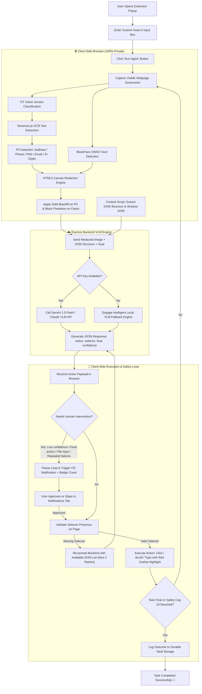

# 🛡️ Betaal (बेताल) — Client-Side Privacy-Preserving Browser AI Agent

> **"Sees Everything. Reveals Only What Matters."**  
> *Built for Smart India Hackathon (SIH)*

Betaal is a cross-browser extension (Chrome, Firefox & Edge MV3) that enables cloud Vision-Language Models (VLMs) to reason over and automate web interactions without ever exposing Personally Identifiable Information (PII) or user biometrics to cloud servers.

---

## 🔑 Environment & Database Setup

### 1. API Keys (Do you need Gemini or Anthropic API keys?)
- **Optional**: You can run the backend with a real **Gemini API Key** (`GEMINI_API_KEY`) or **Anthropic Claude Key** (`ANTHROPIC_API_KEY`) in your `.env` file.
- **Simulated VLM Fallback (No Key Required)**: If no API key is provided, Betaal automatically engages an intelligent local simulated VLM decision engine. You can fully test the extension immediately out-of-the-box without entering any paid API keys!
- **Where to input key**: Create a `.env` file in the project root:
  ```env
  PORT=3000
  GEMINI_API_KEY=your_gemini_api_key_here
  ```

### 2. Databases (MongoDB, Supabase, etc.)
- **No External Database Required!**
- Betaal is built on a **Zero-Trust, Zero-Persistence Architecture**.
- **Client-Side Storage**: Local run history and audit records are saved directly in your browser's private storage (`chrome.storage.local`).
- **Server Memory**: The backend processes VLM requests entirely in transient memory without saving any screenshots, PII text, or log files to a database.

---

## 🌐 Generalization & Real-Site Support

**Does Betaal work on every web page?**
- **YES!** Betaal is designed for general-purpose web browsing across all standard websites:
  - **E-Commerce Checkouts**: Automatically handles multi-step checkout forms, addresses, and payment fields while capping DOM elements at 50 to maintain fast network performance.
  - **Fintech & Banking**: Traverses form inputs while redacting account numbers, passwords, card numbers, and PII.
  - **Dynamic Single-Page Apps (React/Vue/Angular)**: Recursively traverses **Shadow DOM roots** (`element.shadowRoot`) to detect custom components and input fields.
  - **Embedded Video & Webcam Pages**: Runs BlazeFace ONNX face detection over webcam tiles to obscure faces with non-reversible block pixelation.
  - **Generic PII Detection**: Automatically catches 9+ digit ID sequences (`possible-id-number`, US SSN formats, credit cards) in addition to Indian Aadhaar, PAN, phone numbers, and email patterns.
- **Restricted Pages Protection**: For security reasons, browser engines restrict extensions from capturing system internal pages (e.g. `chrome://settings`, Chrome Web Store, `about:config`). Betaal detects these pages and displays a clean, friendly notification banner without crashing.

---

## 🦊 How to Prepare Betaal for Firefox

Betaal includes native cross-browser support and a built-in `browser-polyfill.js` API shim.

1. **Switch Manifest File**:
   Copy the Firefox-compatible manifest over `manifest.json`:
   ```bash
   cp manifest-firefox.json manifest.json
   ```
2. **Open Firefox Add-ons Debugging**:
   - In Mozilla Firefox, go to `about:debugging#/runtime/this-firefox`.
3. **Load Add-on**:
   - Click **"Load Temporary Add-on..."**.
   - Select `manifest.json` from the root directory.

*To return to Chrome/Edge: Simply revert `manifest.json` using `git checkout manifest.json`.*

---

## 📊 How Betaal Functions (System Flowchart)



---

## 🛠️ Step-by-Step Functioning of Betaal

### 1. Goal Input & Initialization
- When you click the **Betaal** extension icon, you enter your natural language request in the **Live View** tab (e.g. *"Fill this grievance form and submit"*).
- Clicking **Run Agent** starts the autonomous execution loop.

### 2. Local Vision Privacy Pipeline (Zero-Trust)
Before any network payload leaves your machine:
1. **Screen Capture**: Takes a snapshot of the visible active tab.
2. **ViT Classification**: Classifies the layout type using Vision Transformer models.
3. **OCR & PII Detection**: Extracts text regions via Tesseract.js and identifies sensitive pattern matches (Aadhaar, PAN, phone numbers, email addresses, and generic 9+ digit ID numbers).
4. **Face Obfuscation**: BlazeFace ONNX detects facial biometric regions from webcam widgets.
5. **Canvas Redaction**: Renders an in-memory HTML5 canvas overlay applying **solid black rectangles** over PII text and **irreversible block pixelation** over face bounding boxes.

### 3. DOM Traversal & Sanitized VLM Reasoning
- The content script extracts interactive field metadata (`input`, `button`, `textarea`, `select`), recursively traversing accessible **Shadow DOM roots** (`element.shadowRoot`).
- The **sanitized redacted image** + **DOM metadata list** + **User Goal** are transmitted to the Express backend (`http://localhost:3000/api/agent/step`).
- The VLM computes the single best next action and returns structured JSON:
  ```json
  {
    "action": "type",
    "selector": "#citizen-name",
    "value": "Anuj Gupta",
    "reasoning": "Filling citizen name field to proceed with grievance submission",
    "final": false,
    "confidence": 0.95
  }
  ```

### 4. Robust Action Execution & Self-Correction
- **Selector Validation**: Before clicking or typing, `action-executor.js` verifies that `document.querySelector(action.selector)` exists. If a selector is missing, Betaal automatically re-prompts the backend with the current DOM list up to 2 times without breaking.
- **Visual Feedback**: Applies a temporary 3px red outline to target elements for clear user transparency during execution.

### 5. Human-in-the-Loop Interventions & Notifications
- If an action triggers safety rules (final submission step, low confidence < 60%, file upload input, or repeated selector failures), Betaal **pauses the loop**.
- Displays an OS desktop notification and increments an extension icon badge.
- The user can open the **Notifications** tab to **"Approve & Continue"** or **"Stop Here"**.

### 6. Durable Vault Audit Storage
- At the end of every agent run, metadata (timestamps, site URLs, PII/face counts, action summaries) is saved to browser storage (`chrome.storage.local`).
- You can review past activity under the **Vault** tab anytime. Raw PII values and unredacted screenshots are **never** stored.

---

## ✨ Features & Popup UI

- 🖥️ **Live View Tab**: Interactive execution controls, live timing breakdown telemetry, side-by-side original vs redacted screenshot zoom modals, and safe PII detection audit tables.
- 📦 **Vault Tab**: Reverse-chronological log of past automation runs storing metadata only (counts and actions) without saving raw PII or screenshots.
- 🔔 **Notifications Tab**: Human-in-the-loop intervention approval for low-confidence decisions, final step confirmation, file inputs, or repeated selector retries.
- 🚨 **Badge & OS Notifications**: Displays real OS desktop notifications and icon badge counts when human approval is required.

---

## 📁 Repository Structure

```text
Betaal/
├── manifest.json              # Chrome/Edge Manifest V3 configuration
├── manifest-firefox.json      # Firefox Manifest V3 variant
├── background.js              # Background service worker & notifications handler
├── content.js                 # Content script for shadow DOM extraction & action listener
├── popup.html / popup.js      # 3-Tab Extension Popup UI (Live View, Vault, Notifications)
├── extension/
│   ├── browser-polyfill.js    # Cross-browser promise-based API shim
│   ├── pipeline.js            # Orchestrates vision classification, detection, & redaction
│   ├── network.js             # API layer connecting extension to backend
│   ├── action-executor.js     # Validates & executes click, scroll, and type actions
│   ├── intervention-rules.js  # Human-in-the-loop decision engine
│   ├── vault.js               # Browser local storage for audit records
│   ├── detection/
│   │   ├── ocr.js             # Tesseract.js OCR wrapper
│   │   ├── pii-patterns.js    # Regex engine (Aadhaar, Phone, PAN, Email, Generic 9+ digits)
│   │   ├── pii-detector.js    # Combined PII detector engine
│   │   ├── vit-classifier.js  # ViT ONNX screen classifier with WebGPU/WASM fallback
│   │   └── face-detect.js     # BlazeFace ONNX detector with NMS
│   └── redaction/
│       └── redact.js          # Canvas 2D engine for black-fill & block pixelation
├── backend/
│   ├── server.js              # Express server with CORS & zero-persistence memory pipeline
│   ├── llm.js                 # VLM API caller & JSON response parser
│   └── llm-prompt.js          # Privacy-aware VLM prompt generator
├── demo-page/
│   └── index.html             # Mock Citizen Grievance Portal & Webcam tile
├── docs/
│   ├── demo-script.md         # Timed presentation script for hackathon judges
│   ├── firefox-build.md       # Firefox deployment & manifest swap guide
│   ├── generalization-testing.md # Real-world site testing & Edge compatibility
│   └── kill-switch-demo.md    # Offline client-side verification steps
└── package.json
```

---

## 🚀 Getting Started

### 1. Installation

```bash
git clone https://github.com/annujjguptaa-cpu/Betaal.git
cd Betaal
npm install
```

### 2. Run Backend Server

```bash
npm start
```

### 3. Load Extension in Browser

1. Open Chrome/Edge and go to `chrome://extensions` or `edge://extensions`.
2. Turn ON **Developer mode**.
3. Click **Load unpacked** and select the `Betaal` folder.
4. Click the **Betaal** extension icon, enter a goal, and click **Run Agent**.

---

## 📄 License
ISC License
