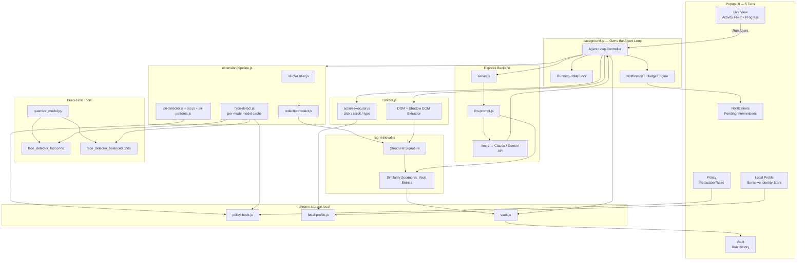

# 🛡️ Betaal (बेताल) — Client-Side Privacy-Preserving Browser AI Agent

> **"Sees Everything. Reveals Only What Matters."**  
> *Built for Smart India Hackathon (SIH) — Problem Statement SIH26171*

Betaal is a cross-browser extension (Chrome, Firefox & Edge, Manifest V3) that lets a cloud Vision-Language Model reason over and act on real web pages — filling forms, clicking through multi-step flows, completing tasks — without ever exposing raw PII or biometrics to a server. Every sensitive pixel is detected and redacted entirely on-device before anything crosses the network, the agent runs as a real autonomous loop rather than a single click, and it pauses to ask a human whenever a decision is genuinely risky or beyond what it can safely do alone.

---

## 🔑 Key Capabilities at a Glance

| Capability | What it means |
| :--- | :--- |
| **Zero-Trust redaction pipeline** | ViT screen classification, OCR + regex PII detection, ONNX face detection, and canvas-based redaction all run locally — nothing sensitive leaves the device unredacted |
| **Autonomous agent loop** | Capture → detect → redact → reason → act → repeat, owned by the background service worker, so it keeps running even if the popup is closed |
| **Human-in-the-loop intervention** | Pauses automatically on final/irreversible actions, low-confidence decisions, file uploads, or repeated failures — OS notification + badge count, resolved from the Notifications tab or inline feed cards |
| **Policy Book** | Every redaction rule (what counts as sensitive, how it's redacted) is user-editable at runtime, with per-site overrides — not a black-box decision |
| **Local Profile** | Real sensitive values (Aadhaar, phone, address) are resolved on-device only when filling a form — the cloud model only ever identifies which field needs filling, never the literal value |
| **Performance Mode** | Fast (quantized model) / Balanced (default) / Accurate (upscaled input) — a live, switchable answer to the latency-vs-accuracy tradeoff, not just a claim on a slide |
| **RAG-grounded reasoning** | Before deciding a next action, the agent retrieves structurally similar past successful runs from its own local Vault and includes them as precedent, reducing hallucinated selectors on unfamiliar sites |
| **Durable local audit Vault** | Every run is logged — what was detected, what action was taken, what policy was active — locally, metadata only, never raw values |
| **Cross-browser** | Native Chrome/Edge support, plus a Firefox-compatible manifest and polyfill shim |

---

## 🔑 Environment & Database Setup

### 1. API Keys (Do you need Gemini or Anthropic API keys?)
- **Optional**: Run the backend with a real **Gemini API Key** (`GEMINI_API_KEY`) or **Anthropic Claude Key** (`ANTHROPIC_API_KEY`) in your `.env` file.
- **Simulated VLM Fallback (No Key Required)**: With no API key, Betaal automatically engages a local simulated decision engine — fully testable out of the box, no paid keys required.
- **Where to input key**: Create a `.env` file in the project root:
  ```env
  PORT=3000
  GEMINI_API_KEY=your_gemini_api_key_here
  ```

### 2. Databases (MongoDB, Supabase, etc.)
- **No external database required!** Betaal is built on a **Zero-Trust, Zero-Persistence architecture**.
- **Client-side storage**: Vault history, Policy Book rules, and the Local Profile are all stored in `chrome.storage.local` — never synced, never sent to the backend.
- **Server memory**: The backend processes VLM requests in transient memory only — no screenshots, PII text, or logs are ever written to disk or a database.

---

## 🌐 Generalization & Real-Site Support

Betaal is built for general-purpose browsing, not just its own demo pages:
- **E-commerce checkouts**: multi-step forms, addresses, payment fields — DOM extraction capped at 50 elements, prioritizing visible fields, to stay fast on complex pages
- **Fintech & banking pages**: redacts account numbers, card numbers, and PII across arbitrary field layouts
- **Dynamic single-page apps (React/Vue/Angular)**: recursively traverses accessible Shadow DOM roots, retries once on pages that appear to still be rendering
- **Embedded video/webcam widgets**: BlazeFace ONNX detection blurs faces via irreversible block pixelation
- **Broader PII coverage**: Aadhaar, PAN, phone, email, plus a generic fallback catching any 9+ digit sequence (covering formats like SSNs or card numbers not individually pattern-matched)
- **Restricted pages**: `chrome://`, the Web Store, and similar system pages are detected up front and handled with a clean, friendly message instead of a crash
- **Selector self-correction**: if a chosen element no longer matches the live DOM, the agent re-sends the real structure and asks for a corrected selector, up to 2 retries, before falling back to asking the user
- **Verified independently**: see `docs/qa-automated-testing.md` for the autonomous QA prompt used to test the extension against real, unfamiliar live sites and produce a structured pass/fail report

---

## 🦊 How to Prepare Betaal for Firefox

Betaal ships with a `browser-polyfill.js` shim so the same codebase runs on both engines.

1. **Switch manifest file**:
   ```bash
   cp manifest-firefox.json manifest.json
   ```
2. **Open Firefox debugging**: go to `about:debugging#/runtime/this-firefox`
3. **Load add-on**: click **Load Temporary Add-on...**, select `manifest.json`

To return to Chrome/Edge: `git checkout manifest.json`. See `docs/firefox-build.md` for known differences (CSP, service worker lifecycle, WebGPU availability) and how each is handled.

---

## 📊 How Betaal Functions (Full System Flowchart)


### System Architecture Diagram



---

## 🛠️ Step-by-Step Functioning of Betaal

### 1. Goal Input & Mode Selection
- Open the popup, type your task in plain language in the **Live View** tab (e.g., *"Fill this grievance form and submit"*).
- Pick a **Performance Mode** (`Fast` / `Balanced` / `Accurate`) — this decides which face-detector model variant loads and whether input is upscaled before detection.
- Click **Run Agent**. The loop starts in `background.js` and keeps running even if you close the popup.

### 2. Local Vision Privacy Pipeline (Zero-Trust)
Before any network request is built:
- Capture the visible tab, then wait for the DOM to stabilize (avoids capturing a half-rendered page).
- Classify the screen content with the local ViT model.
- Detect text-based PII via Tesseract.js OCR + regex (Aadhaar, PAN, phone, email, and a generic 9+ digit fallback).
- Detect faces via BlazeFace ONNX, using whichever model variant matches the selected Performance Mode.
- Check the Policy Book — only redact what's currently enabled; disabled rules are skipped and counted separately, never silently ignored.
- Redact on canvas — solid black-fill for text, irreversible block-pixelation for faces.

### 3. Grounded Reasoning (DOM + RAG + VLM)
- The content script extracts interactive elements (`input`, `button`, `textarea`, `select`), including accessible Shadow DOM content, capped at 50 elements.
- A structural signature of the current page (field count, types, button labels — no values) is computed and used to retrieve the most similar successful past runs from the local Vault.
- The redacted image, DOM structure, goal, and these retrieved examples are sent to the backend, which builds a prompt instructing the VLM to use the examples as precedent but ground its decision in the actual current structure.
- The VLM returns a structured action: `{ "action": "type", "selector": "#citizen-name", "valueSource": "fullName", "final": false, "confidence": 0.95 }`.
- For fields the DOM marked sensitive, the response carries a `valueSource` key (e.g. `aadhaar`) rather than a literal value — the VLM never saw the real data, so it can't be the source of it.

### 4. Robust, Self-Correcting Execution
- Immediately before acting, the selector is re-validated against the live DOM (not just checked once) — if it's gone stale, the agent re-prompts the backend with the current structure, up to 2 retries.
- For a `type` action with `valueSource` set, the real value is resolved locally from the Local Profile — it never touches the network, in either direction.
- Actions execute with a brief red-outline highlight and a small human-like pacing delay between steps.

### 5. Human-in-the-Loop Intervention
- The loop pauses automatically — not optionally — when: the action is marked final, confidence is below 0.6, the target is a file upload, or the same selector has failed twice. An OS notification fires and the extension badge increments even if the popup is closed.
- The user resolves it from the Notifications tab or directly inline in the Live View feed — **Approve & Continue**, **Stop Here**, or provide an optional text correction (*"Or tell it what to do instead"*).

### 6. Durable Vault Audit Logging
- Every completed run logs: timestamp, site, PII/face counts, actions taken, the Policy Book snapshot active at the time, and the outcome — metadata only, never raw values or screenshots.
- This same Vault powers RAG retrieval for future runs, so the agent gets more reliable the more it's used.

---

## ✨ Features & Popup UI

- 🖥️ **Live View** — goal input, Performance Mode selector, a live scrolling activity feed narrating each step in plain language with VLM reasoning, original-vs-redacted thumbnails, and per-stage latency telemetry.
- 📦 **Vault** — reverse-chronological run history with expandable Policy Book snapshots per entry, metadata only.
- 🔔 **Notifications** — pending interventions with Approve/Stop/Correction, resolvable here or inline in the feed card, backed by real OS notifications and an icon badge count.
- ⚙️ **Policy** — every redaction rule, toggleable and method-configurable, with per-site overrides.
- 👤 **Local Profile** — where the user enters real sensitive values once, stored locally in `chrome.storage.local`, used only to resolve `type` actions on-device.

---

## 📁 Repository Structure

```text
Betaal/
├── manifest.json                  # Chrome/Edge Manifest V3 configuration
├── manifest-firefox.json          # Firefox Manifest V3 variant
├── background.js                  # Owns the agent loop, notifications, badge count
├── content.js                     # DOM/Shadow DOM extraction, action listener
├── popup.html / popup.js          # 5-tab popup UI (Live View, Vault, Notifications, Policy, Profile)
├── extension/
│   ├── browser-polyfill.js        # Cross-browser promise-based API shim
│   ├── pipeline.js                # Orchestrates classification, detection, redaction
│   ├── network.js                 # Extension-to-backend API layer
│   ├── action-executor.js         # Validates & executes click/scroll/type with local valueSource resolution
│   ├── intervention-rules.js      # Human-in-the-loop decision engine
│   ├── vault.js                   # Local audit storage
│   ├── policy-book.js             # Runtime-editable redaction rules
│   ├── local-profile.js           # Locally-resolved sensitive values, never transmitted
│   ├── rag-retrieval.js           # Structural signature + Vault similarity retrieval
│   ├── detection/
│   │   ├── ocr.js                 # Tesseract.js OCR wrapper
│   │   ├── pii-patterns.js        # Regex engine incl. generic 9+ digit fallback
│   │   ├── pii-detector.js        # Combined PII detector
│   │   ├── vit-classifier.js      # ViT ONNX screen classifier, WebGPU/WASM
│   │   └── face-detect.js         # BlazeFace ONNX detector, per-mode model, NMS
│   ├── models/
│   │   ├── face_detector_fast.onnx # Quantized — Fast mode
│   │   └── face_detector_balanced.onnx # Standard — Balanced/Accurate mode
│   └── redaction/
│       └── redact.js              # Canvas black-fill + block pixelation
├── backend/
│   ├── server.js                  # Express server, CORS, zero-persistence
│   ├── llm.js                     # VLM API caller & JSON response parser
│   └── llm-prompt.js              # Privacy-aware, RAG-grounded prompt builder
├── demo-page/
│   ├── index.html                 # Mock citizen grievance portal + webcam tile
│   └── passport-application.html  # Multi-step wizard demonstrating the full agent loop
├── scripts/
│   ├── quantize_model.py          # One-time build tool producing the Fast model variant
│   └── qa-test.js                 # Antigravity-generated autonomous real-site QA script
├── docs/
│   ├── demo-script.md             # Timed presentation script for judges
│   ├── firefox-build.md           # Firefox deployment & manifest swap guide
│   ├── generalization-testing.md  # Real-site testing notes (bank, healthcare, SPA, etc.)
│   ├── kill-switch-demo.md        # Offline client-side verification steps
│   ├── model-variants.md          # Fast/Balanced/Accurate model sourcing notes
│   ├── rag-effectiveness.md       # Documented before/after comparison of RAG grounding
│   └── qa-automated-testing.md    # How to run the autonomous QA prompt
└── package.json
```

---

## 🚀 Getting Started

### 1. Installation
```bash
git clone https://github.com/annujjguptaa-cpu/Betaal.git
cd Betaal
npm install
```

### 2. Generate the Performance Mode model variants (one-time)
```bash
pip install onnxruntime onnx --break-system-packages
python scripts/quantize_model.py
```

### 3. Run the backend server
```bash
npm start
```

### 4. Load the extension in your browser
1. Open Chrome/Edge → `chrome://extensions` or `edge://extensions`
2. Enable **Developer mode**
3. Click **Load unpacked**, select the `Betaal` folder
4. Click the Betaal icon, enter a goal, pick a Performance Mode, and click **Run Agent**

> For Firefox setup, see the [How to Prepare Betaal for Firefox](#-how-to-prepare-betaal-for-firefox) section above.

---

## 📄 License

ISC License
