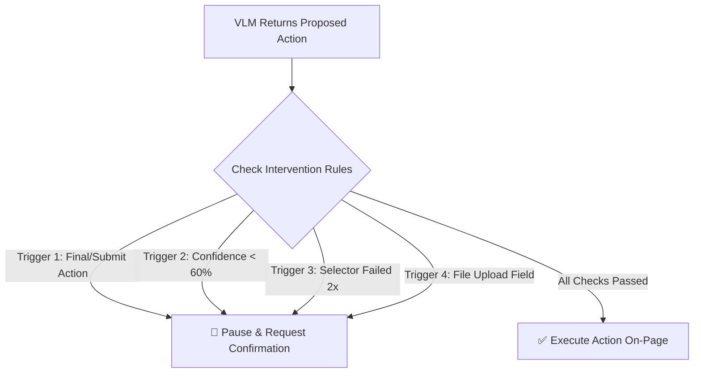

# 📜 Betaal Policy Book (Core Execution & Governance Rules)

> **Overview**: Betaal operates on a strict **Zero-Trust, Zero-Cloud Persistence Policy**. All decisions made by the autonomous agent are governed by deterministic local security rules built directly into the extension client.

---

## 🛡️ Rulebook 1: Zero-Cloud PII & Data Sovereignty Rules

| Rule ID | Rule Name | Specification & Logic | Enforcement Mechanism |
| :--- | :--- | :--- | :--- |
| **POL-101** | **Client-Side Data Resolution (`valueSource` Contract)** | Sensitive personal information (Aadhaar, PAN, Passport, Phone, Email) must **NEVER** leave the browser. Cloud VLMs receive key aliases (`valueSource: "fullName"`), and actual values are resolved locally right before typing. | Enforced by [local-profile.js](file:///c:/Users/ASUS/OneDrive/Desktop/Betaal/extension/local-profile.js). `local-profile.js` is isolated from network request builders. |
| **POL-102** | **Irreversible Canvas Sanitization** | Screenshots sent to cloud VLMs must undergo client-side face blurring (BlazeFace ONNX / ViT) and black-out redaction over sensitive text fields prior to network payload building. | Enforced in [popup.js](file:///c:/Users/ASUS/OneDrive/Desktop/Betaal/popup.js) & [pipeline.js](file:///c:/Users/ASUS/OneDrive/Desktop/Betaal/extension/pipeline.js) before calling `/act`. |
| **POL-103** | **Zero-Persistence Backend** | The Express backend (`backend/server.js`) acts purely as a pass-through gateway to the VLM. It stores zero logs, zero database entries, and zero user state. | Verified in [server.js](file:///c:/Users/ASUS/OneDrive/Desktop/Betaal/backend/server.js). |

---

## 🛑 Rulebook 2: Human-in-the-Loop (HITL) Intervention Rules

The agent automatically **pauses execution** and requires explicit user confirmation via the UI whenever any of the following triggers are hit:

| Trigger ID | Rule Name | Threshold / Condition | Action Taken |
| :--- | :--- | :--- | :--- |
| **HITL-201** | **Final Action Guard** | `action.final === true` (e.g. "Submit Grievance", "Confirm Payment", "Register"). | Pauses agent. Displays confirmation card in popup. |
| **HITL-202** | **Low Confidence Guard** | VLM confidence score `< 0.6` (less than 60%). | Pauses agent. Requests user approval or manual correction. |
| **HITL-203** | **Consecutive Failure Guard** | `consecutiveFailures >= 2` on the exact same DOM selector. | Pauses agent. Prompts user to manually click or enter missing data. |
| **HITL-204** | **File Upload Guard** | Target element is `<input type="file">`. | Pauses agent. Requests user to select local file manually. |

*Implementation Reference*: [extension/intervention-rules.js](file:///c:/Users/ASUS/OneDrive/Desktop/Betaal/extension/intervention-rules.js#L15-L53)

---

## 🔍 Rulebook 3: Pattern & PII Detection Rules

| Entity Type | Regex Pattern / Keywords | Behavior |
| :--- | :--- | :--- |
| **Aadhaar** | `\b[2-9]\d{3}[\s-]?[0-9]{4}[\s-]?[0-9]{4}\b` | Redacted with black fill (`aadhaar`). |
| **PAN Card** | `\b[A-Z]{5}[0-9]{4}[A-Z]{1}\b` | Redacted with black fill (`pan`). |
| **Phone** | `(?:\+91[\s-]?)?[6-9]\d{4}[\s-]?\d{5}\b` | Redacted with black fill (`phone`). |
| **Email** | `[a-zA-Z0-9._%+-]+@[a-zA-Z0-9.-]+\.[a-zA-Z]{2,}` | Redacted with black fill (`email`). |
| **Generic ID** | 9+ consecutive digits (excluding currency/decimal) | Redacted with black fill (`possible-id-number`). |

*Implementation Reference*: [extension/detection/pii-patterns.js](file:///c:/Users/ASUS/OneDrive/Desktop/Betaal/extension/detection/pii-patterns.js)

---

## ⚡ Rulebook 4: DOM Extraction & Selector Self-Correction Rules

1. **Top-50 Interactive Element Cap**: To prevent token bloat and latency spikes on large pages, DOM extraction selects up to 50 interactive elements (`input`, `button`, `select`, `textarea`, `a`), prioritizing visible elements in the active viewport.
2. **Pre-Action Selector Validation**: Right before executing an action, the content script verifies if `document.querySelector(selector)` exists. If the selector is missing (due to dynamic React/Vue rendering), Betaal re-queries the VLM with fresh DOM context (up to 2 retries) before triggering HITL-203.
3. **Pacing & Cursor Animation**: Every action executes with a minimum 300ms pacing delay and animated cursor glide to provide visual feedback and prevent anti-bot detection.

*Implementation Reference*: [content.js](file:///c:/Users/ASUS/OneDrive/Desktop/Betaal/content.js#L40-L60) & [background.js](file:///c:/Users/ASUS/OneDrive/Desktop/Betaal/background.js#L650-L690)

---

## 🧠 Rulebook 5: Local RAG Precedent Engine Rules

1. **Structural Signature Hashing**: Past successful runs are indexed in `chrome.storage.local` using Jaccard Similarity over page field counts, element tags, and button labels (zero text values).
2. **Client-Side Context Injection**: When visiting a site with high structural similarity (score `> 0.65`), top past execution steps are injected into the input context to guide VLM decision-making.
